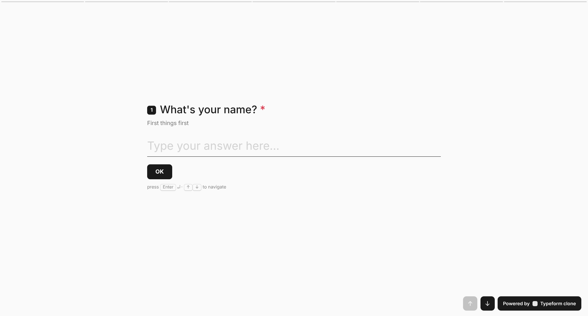
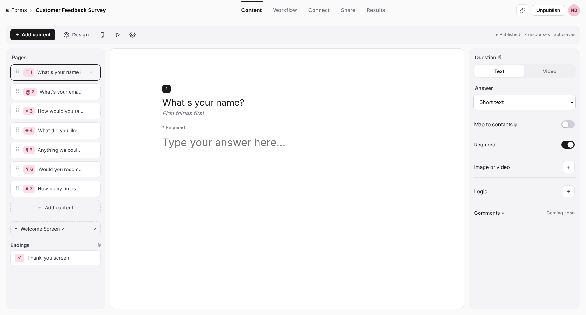
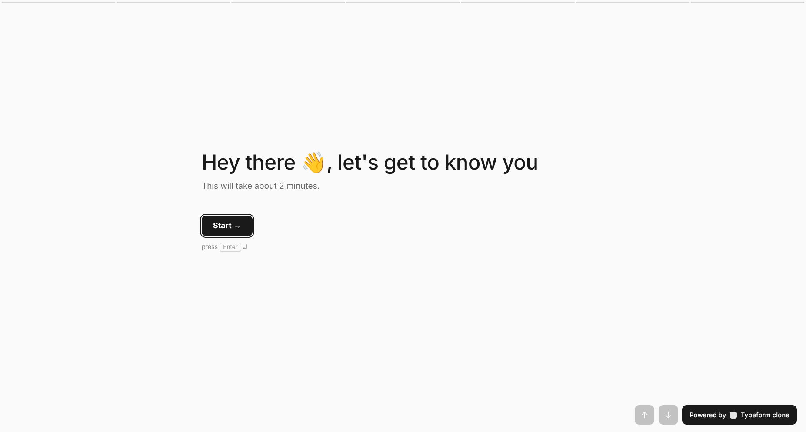
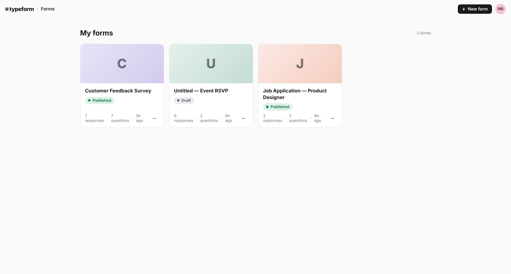
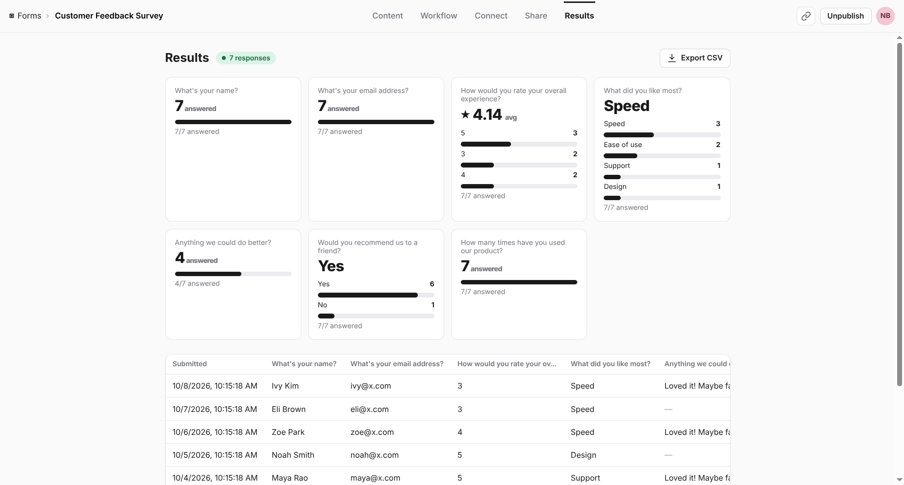

# Stepform

Conversational forms, one question at a time — a functional clone of
[Typeform](https://www.typeform.com). Build forms in a drag-and-drop builder, share them with a
public link, collect responses through the signature full-screen flow, and analyse results.



> **Live demo:** coming soon — backend + frontend deploy in progress.
> The demo resets periodically (SQLite on serverless); it reseeds itself with sample data.
> No login needed anywhere: the creator is pre-signed-in, and respondents need no account
> (see [Demo access](docs/setup.md#demo-access)).

## Product tour

| Builder | Respondent |
|---|---|
|  |  |
| Drag-and-drop pages rail, live canvas preview, per-question settings, themes, publish/share, results | One-question-at-a-time flow with keyboard nav, progress segments and validation |

| Dashboard | Results |
|---|---|
|  |  |
| Status pills, response counts, rename / duplicate / delete | Per-question stats, responses table, detail view, CSV export |

## Features

- **Builder** — title + ordered questions; add, edit, drag-and-drop reorder (with keyboard
  fallback), duplicate, delete; 8 types (short/long text, multiple choice, dropdown, email,
  number, yes/no, rating); required toggle; help text; live preview; welcome + thank-you screens;
  custom themes (background, text, button, font)
- **Management** — dashboard with draft/published status and response counts; create, rename,
  duplicate, delete; publish/unpublish with shareable `/s/{id}` link; everything persisted
- **Respondent** — full-screen one-at-a-time flow, slide/fade transitions, Enter/↑↓/shortcut keys,
  segmented progress, client + server validation, thank-you screen, no login required
- **Results** — stat cards (counts, averages, answer rates), responses table, per-response detail,
  CSV export
- **Placeholders** — logic jumps, integrations/webhooks, teams, file-upload/payment types
  (present as clearly-marked "coming soon" surfaces)

## Quick start

```bash
# backend (Python 3.12+, :8000)
cd backend
python -m venv .venv && source .venv/bin/activate
pip install -r requirements.txt
python seed.py            # optional — the app self-seeds an empty DB on boot
uvicorn main:app --port 8000

# frontend (:3000) — in another terminal
cd frontend
npm install
npm run dev
```

Open http://localhost:3000. Point the frontend at another API with
`NEXT_PUBLIC_API_URL` (see [Setup](docs/setup.md)).

## Tech stack

| Layer | Choice |
|---|---|
| Frontend | Next.js 14 (App Router) + TypeScript + React 18, hand-built CSS (Inter) |
| Backend | Python + FastAPI + SQLAlchemy, Pydantic-style dict validation |
| Database | SQLite (`backend/typeform.db`), auto-seeded with 3 forms / 14 questions / 10 responses |

## Project structure

```
stepform/
  frontend/          # Next.js app (dashboard, builder, respondent flow)
  backend/           # FastAPI app (main.py), models.py, seed.py
  docs/
    architecture.md  # system, data & flow diagrams
    api.md           # endpoint reference + validation rules
    setup.md         # local setup, demo access, deployment
    assets/          # screenshots used above
```

## Docs

- [Architecture & diagrams](docs/architecture.md)
- [API reference](docs/api.md)
- [Setup, demo access & deployment](docs/setup.md)

## Assumptions

- Single default creator (no real auth — permitted by the brief); respondents need no account.
- Only `published` forms are publicly fillable (drafts 404; creators get a `?draft=1` preview).
- Validation runs on client **and** server (required, email, plain-decimal number, rating range,
  choice-against-options, yes/no).
