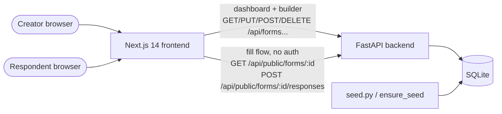
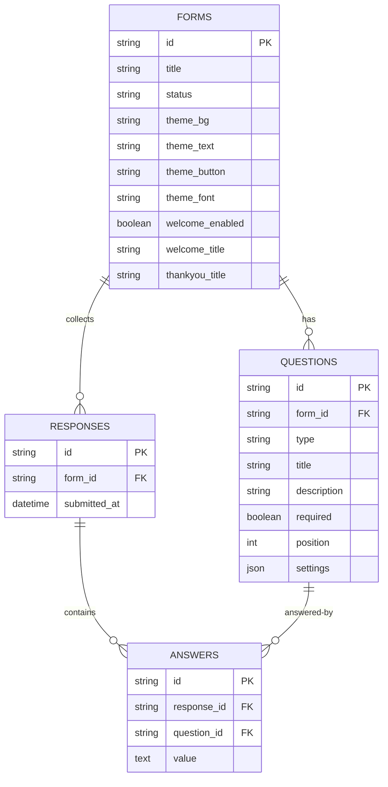
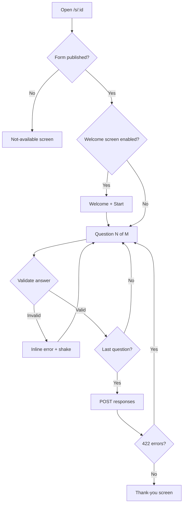
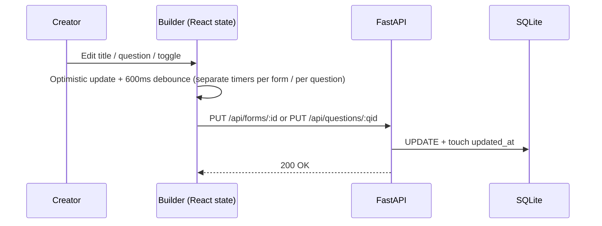

# Architecture

How Stepform fits together: a Next.js frontend talking to a FastAPI backend over a small JSON
API, with SQLite underneath. No auth service, no ORM magic beyond vanilla SQLAlchemy, no
framework CSS — every layer is explainable in an interview.

## System



- `frontend/` — three routes: `/` (dashboard), `/forms/[id]` (builder with Content/Share/Results
  tabs), `/s/[id]` (public respondent flow). Typed API client in `frontend/lib/api.ts`.
- Dark mode covers the creator workspace only: a `data-theme` attribute on `<html>`
  (`components/theme.tsx`, sun/moon toggle, stored preference with OS fallback, applied before
  first paint), with all colors flowing through CSS variables in `app/globals.css`. The
  respondent flow always renders the form's own theme, untouched.
- `backend/main.py` — all routes plus server-side validation (`validate_answers`).
- `backend/models.py` — four tables (below). `backend/seed.py` builds the demo dataset and is
  re-run automatically when the database is empty (fresh clones, serverless cold starts).

## Data model (key columns — see `models.py` for the full detail)



```
forms (id PK short hex, title, description, status draft|published,
       theme_bg/text/button/font, welcome_enabled/title/description/button,
       thankyou_title/description, created_at, updated_at)
  1───* questions (id PK uuid, form_id FK→forms, type, title, description,
                   required, position, settings JSON {options[], max_rating})
  1───* responses (id PK uuid, form_id FK→forms, submitted_at)
            1───* answers (id PK uuid, response_id FK→responses,
                           question_id FK→questions, value TEXT)
```

Design notes:

- All 8 question types share one table; type-specific config (`options[]`, `max_rating`) lives in
  the `settings` JSON column. New types need no migration — the API whitelists them
  (`ALLOWED_TYPES` in `main.py`).
- Answers are stored as plain text (numbers/ratings are validated, then stringified), which keeps
  the CSV export a straight row dump.
- Deletes cascade: form → questions → responses → answers; deleting a question deletes its answers
  and renumbers the survivors. No partial-response tracking by design (see
  [setup](setup.md#demo-access) — an honest omission, not a missing feature.

## Respondent flow (one question at a time)



Keyboard: `Enter` advances (opens/commits dropdowns), `↑`/`↓` move or navigate, `1–9`/`0`
pick choices/ratings, `Y`/`N` answer yes/no.

## Builder autosave



Reorders are optimistic too, then confirmed with `PUT /api/forms/:id/reorder`. Pending edits flush
on page leave, so rapid interleaved edits can't cancel each other.
